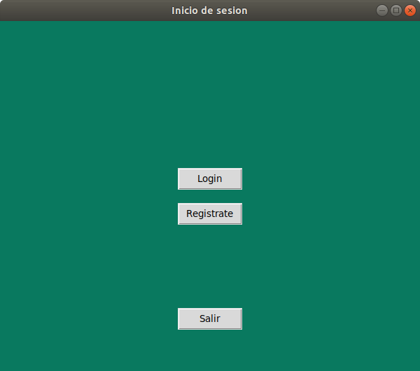
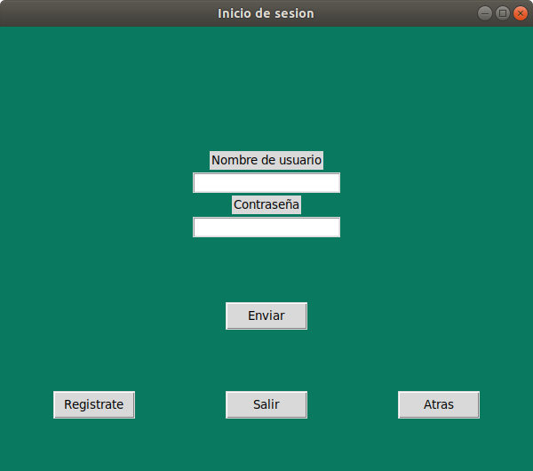
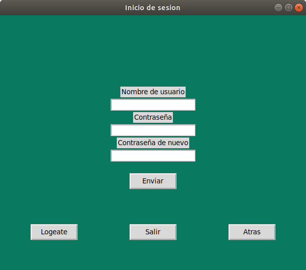

# LoginRegister
Implementation of a login/register system with a graphical interface using tkinter on Python3.
The current version uses text files for storing both the usernames and passwords, which is unsafe.

## How to run
You will need to have tkinter installed on your computer/workspace to be able to run it.
Download the code and type on your terminal:
>python3 main.py

